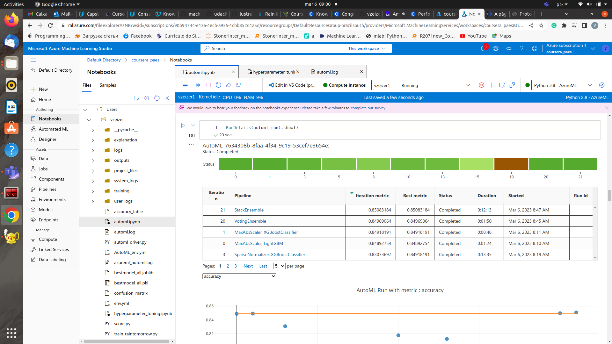
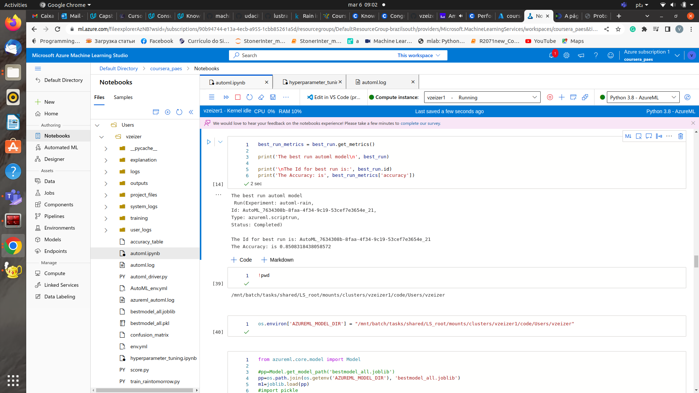
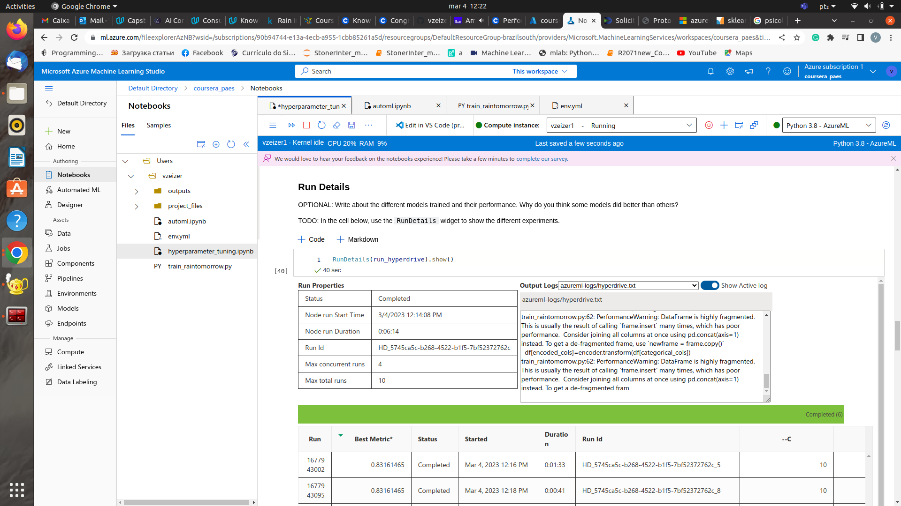
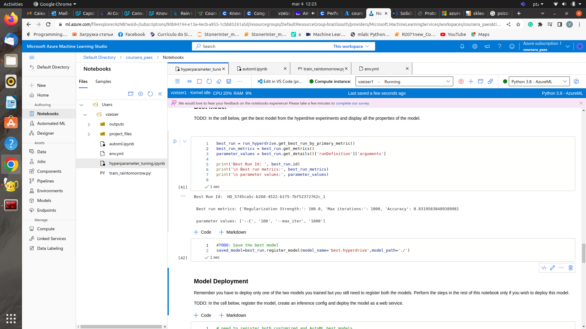
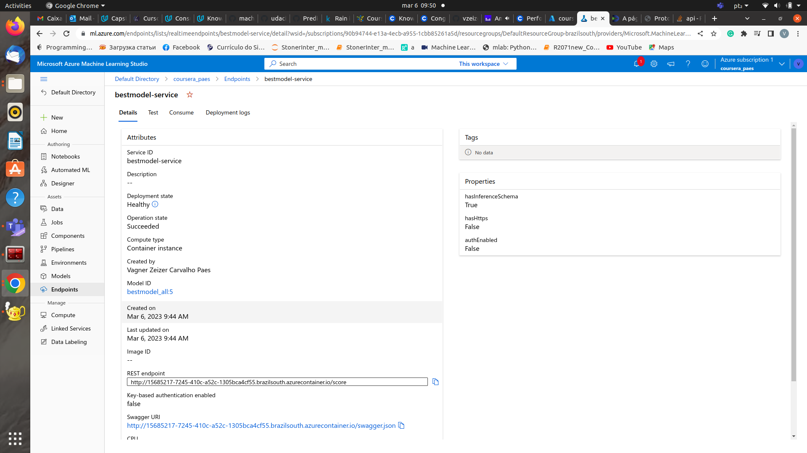
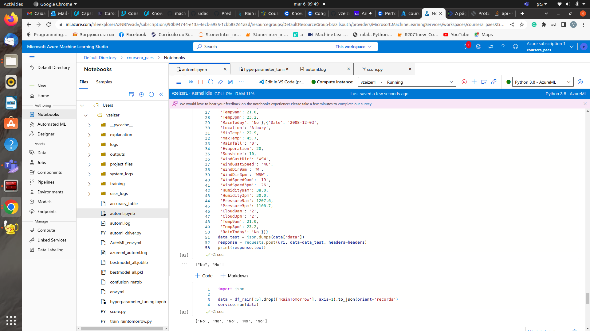

# Capstone Project Udacity MLEng w/ Microsoft Azure: Rain Tomorrow in Australia prediction using AzureML

This project consists of using AzureML to find the best model through either AutoML or a customized ML, comparing them, deploying the best model, and consuming it. 
The investigated dataset contains about 10 years of daily weather observations from many locations across Australia.

**RainTomorrow** is the target variable to predict. 
It means - Will it rain the next day, Yes or No? 
This column is Yes if the rain for that day was 1mm or more.

## Project Set Up and Installation

To turn this project into a professional portfolio project, 
you are encouraged to explain how to set up this project in AzureML.

## Dataset

### Overview
I got the data from Kaggle, from [here](https://www.kaggle.com/datasets/jsphyg/weather-dataset-rattle-package?resource=download).
The original columns of the dataset are the following:

- 'Date': Date of acquisition;
- 'Location': Location where data was collected;
- 'MinTemp': Mininum temperature of a given day;
- 'MaxTemp': Maximum temperature of a given day;
- 'Rainfall': rainfall level;
- 'Evaporation': evaporation level in a given day;
- 'Sunshine': subshine time;
- 'WindGustDir': Wind direction in a given day;
- 'WindGustSpeed': Wind speed for a given day;
- 'WindDir9am': Wind direction at 9 am;
- 'WindDir3pm': Wind direction at 3 pm;
- 'WindSpeed9am': Wind Speed at 9 am;
- 'WindSpeed3pm': Wind Speed at 3 pm;
- 'Humidity9am': Humidity at 9 am;
- 'Humidity3pm': Humidity at 3 pm;
- 'Pressure9am': Pressure at 9 am;
- 'Pressure3pm': Pressura at 3 pm;
- 'Cloud9am': Cloud level at 9 am;
- 'Cloud3pm': Cloud level at 3 pm;
- 'Temp9am': Temperature at 9 am;
- 'Temp3pm': Temperature at 3 pm;
- 'RainToday': whether it rains today;
- 'RainTomorrow': the target variable, whether it will rain tomorrow.

### Data Cleaning

The following procedures were performed for data cleaning of the dataset:

1. drop non-numerical values form "RainTomorrow" and "RainToday";
2. binarize "RainTomorrow" and "RainToday";
3. create date related features;
4. Use SimpleImputer with "mean" strategy for the categorical variables;
5. Use Select KBest with f_classif metric in order to get the 12 most important features;
6. Finally, it returns the engineered features and target variables.

Keep in mind that the SelectKBest method selects the features according to the **k** highest scores, which were chosen as to be 12, and the scoring metric used was the **f_classif** function, which computes ANOVA F-value for the provided sample.

### Task

The goal of this project is to predict next-day rain by training classification models on the target variable *RainTomorrow*.
The features used in this project were shown above.

### Access
*TODO*: Explain how you are accessing the data in your workspace.

I am using my own Azure Workspace to do the project.

## Automated ML
*TODO*: Give an overview of the `automl` settings and configuration you used for this experiment

The AutoML experiment settings are the following:

**automl_settings = {"experiment_timeout_minutes":30,
    "task":'classification',
    "primary_metric":'accuracy',
    "compute_target":cpu_cluster,
    "featurization":'auto',
    "training_data":data_rain,
    "label_column_name":'RainTomorrow',
    "n_cross_validations":5,
    "enable_early_stopping":True}
**

briefly explaining it, the AutoML experiment will be run for 30 minutes, the task is classification, the  primary metric to choose the best model is accuracy.
It is also going to use a pre-configured cpu_cluster for the training data which was previously cleaned and prepared for Machine Learning.
The target variable is "RainTomorrow".
In order to perform hyperparameter tuning, the number of cross validations were chosen as to be 5, and early stopping was enabled in order to run quicker a given model, if the metric (accuracy) keeps not improving.

### Results
*TODO*: What are the results you got with your automated ML model? 
What were the parameters of the model? How could you have improved it?

**best model: Pipeline(memory=None,
         steps=[('datatransformer',
                 DataTransformer(enable_dnn=False, enable_feature_sweeping=True, feature_sweeping_config={}, feature_sweeping_timeout=86400, featurization_config=None, force_text_dnn=False, is_cross_validation=True, is_onnx_compatible=False, observer=None, task='classification', working_dir='/mnt/batch/tasks/shared/LS_root/mount...
                 StackEnsembleClassifier(base_learners=[('1', Pipeline(memory=None, steps=[('maxabsscaler', MaxAbsScaler(copy=True)), ('xgboostclassifier', XGBoostClassifier(n_jobs=1, problem_info=ProblemInfo(gpu_training_param_dict={'processing_unit_type': 'cpu'}), random_state=0, tree_method='auto'))], verbose=False)), ('0', Pipeline(memory=None, steps=[('maxabsscaler', MaxAbsScaler(copy=True)), ('lightgbmclassifier', LightGBMClassifier(min_data_in_leaf=20, n_jobs=1, problem_info=ProblemInfo(gpu_training_param_dict={'processing_unit_type': 'cpu'}), random_state=None))], verbose=False)), ('14', Pipeline(memory=None, steps=[('standardscalerwrapper', StandardScalerWrapper(copy=True, with_mean=False, with_std=False)), ('xgboostclassifier', XGBoostClassifier(booster='gbtree', colsample_bytree=1, eta=0.3, gamma=0, max_depth=10, max_leaves=511, n_estimators=10, n_jobs=1, objective='reg:logistic', problem_info=ProblemInfo(gpu_training_param_dict={'processing_unit_type': 'cpu'}), random_state=0, reg_alpha=2.1875, reg_lambda=0.4166666666666667, subsample=0.5, tree_method='auto'))], verbose=False)), ('6', Pipeline(memory=None, steps=[('standardscalerwrapper', StandardScalerWrapper(copy=True, with_mean=False, with_std=False)), ('xgboostclassifier', XGBoostClassifier(booster='gbtree', colsample_bytree=0.5, eta=0.3, gamma=0, max_depth=10, max_leaves=255, n_estimators=10, n_jobs=1, objective='reg:logistic', problem_info=ProblemInfo(gpu_training_param_dict={'processing_unit_type': 'cpu'}), random_state=0, reg_alpha=0, reg_lambda=0.10416666666666667, subsample=0.7, tree_method='auto'))], verbose=False)), ('9', Pipeline(memory=None, steps=[('standardscalerwrapper', StandardScalerWrapper(copy=True, with_mean=False, with_std=False)), ('xgboostclassifier', XGBoostClassifier(booster='gbtree', colsample_bytree=0.5, eta=0.5, gamma=0, max_depth=6, max_leaves=3, n_estimators=10, n_jobs=1, objective='reg:logistic', problem_info=ProblemInfo(gpu_training_param_dict={'processing_unit_type': 'cpu'}), random_state=0, reg_alpha=0.7291666666666667, reg_lambda=2.3958333333333335, subsample=0.8, tree_method='auto'))], verbose=False)), ('7', Pipeline(memory=None, steps=[('maxabsscaler', MaxAbsScaler(copy=True)), ('logisticregression', LogisticRegression(C=1.7575106248547894, class_weight=None, dual=False, fit_intercept=True, intercept_scaling=1, l1_ratio=None, max_iter=100, multi_class='multinomial', n_jobs=1, penalty='l2', random_state=None, solver='lbfgs', tol=0.0001, verbose=0, warm_start=False))], verbose=False)), ('3', Pipeline(memory=None, steps=[('sparsenormalizer', Normalizer(copy=True, norm='l2')), ('xgboostclassifier', XGBoostClassifier(booster='gbtree', colsample_bytree=0.7, eta=0.01, gamma=0.01, max_depth=7, max_leaves=31, n_estimators=10, n_jobs=1, objective='reg:logistic', problem_info=ProblemInfo(gpu_training_param_dict={'processing_unit_type': 'cpu'}), random_state=0, reg_alpha=2.1875, reg_lambda=1.0416666666666667, subsample=1, tree_method='auto'))], verbose=False)), ('13', Pipeline(memory=None, steps=[('maxabsscaler', MaxAbsScaler(copy=True)), ('sgdclassifierwrapper', SGDClassifierWrapper(alpha=7.5510448979591835, class_weight='balanced', eta0=0.001, fit_intercept=True, l1_ratio=0.42857142857142855, learning_rate='constant', loss='modified_huber', max_iter=1000, n_jobs=1, penalty='none', power_t=0.7777777777777777, random_state=None, tol=0.0001))], verbose=False))], meta_learner=LogisticRegressionCV(Cs=10, class_weight=None, cv=None, dual=False, fit_intercept=True, intercept_scaling=1.0, l1_ratios=None, max_iter=100, multi_class='auto', n_jobs=None, penalty='l2', random_state=None, refit=True, scoring=Scorer(metric='accuracy'), solver='lbfgs', tol=0.0001, verbose=0), training_cv_folds=5))],
         verbose=False)
Y_transformer(['LabelEncoder', LabelEncoder()])
**

A little bit hard to explain these model parameters...

*TODO* Remember to provide screenshots of the `RunDetails` widget as well as a screenshot of the best model trained with it's parameters.

Run details of AutoML experiment

Best Model and RunID

The best model of AutoML had an accuracy of **0.85** as shown in the data guardrails of the automl experiment.

## Hyperparameter Tuning
I chose the Logistic Regression to test as model in this dataset because it is a rather simple model, and it has some kind of success in modeling classification problems.
Moreover, it is a "light" model, which would be a fast model to deploy and to consume.
The parameters used for Hyperparameter Tuning of the Logistic Regression model was chosen as to be "C" and "max_iter", the latter being the inverse of the regularization strength and the former the maximum number of iterations for the algorithm to converge. 
The values  of "C" was chosen as to be in [0.01,0.1,1.0,10.,100.] because ranges huge regularization strength to very low.
The "max_iter" parameter as chosen to be in [100,500,1000] because it ranges from few iterations up to a high number.

The Bayesian parameter optimization was chosen because it provides, in general, results as good as a grid search sampling, but in a smarter and faster way.

### Results
*TODO*: What are the results you got with your model? 
What were the parameters of the model? 
How could you have improved it?

I got a Logistic Regression with the Following Parameters:

**Best run metrics: {'Regularization Strength:': 100.0, 'Max iterations:': 1000, 'Accuracy': 0.8319583848938998}**

So, the inverse of the regularization strength was set 100.0, the maximum number of iterations to 1000, and we got an accuracy of: 0.832.
The model could be improved by using C values in the range (100,200,500,1000), for instance. 

*TODO* Remeber to provide screenshots of the `RunDetails` widget as well as a screenshot of the best model trained with it's parameters.

Run details of hyperparameter tuning experiment

Best Model and RunID

## Model Deployment
*TODO*: Give an overview of the deployed model and instructions on how to query the endpoint with a sample input.

A deployment was performed for the best model (Stack Ensemble, from AutoML experiment) using ACI Web Service using cpu_cores=1, memory_gb=1.

The endpoint working is shown here:

The endpoint response working here:

## Screen Recording

the link to the capstone screencast is provided [here](https://www.youtube.com/watch?v=aI-ckzpzJ-k)
Just do not care about the background noise that is happening because of my laptop, unfortunately.

## Standout Suggestions

Some improvements can be performed in the project, in order to enhance it:

1. Run the AutoML experiment for longer times, for instance, 60 minutes;
2. Use other Machine Learning classification models for the customized training model, for instance, KNN and Decision Tree classifiers;
3. perform more feature engineering and try other data cleaning approaches in the customized training model, in order to improve results;
4. Select a larger number (more than 12) of **k** best features obtained from the SelectKBest in the data cleaning process;
5. remove outliers and perform PCA analysis in order to reduce dimensionality of the dataset instead of SelectKBest;
6. Deploy ONNX compatible models obtained from the AutoML or the customized model.

